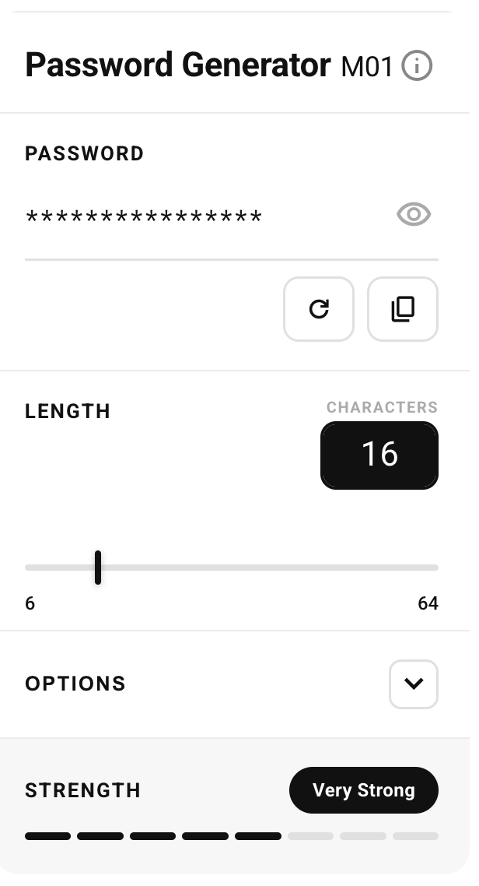

# Password Generator M01

A clean, secure, single-file Chrome extension for generating strong passwords.

## Features

- **Cryptographically secure** — uses `crypto.getRandomValues`, never `Math.random`
- **8-tier strength analysis** — entropy-based scoring from Weak to Bonkers (≥350 bits)
- **Configurable** — length 6–64 with snap points at every 8 characters, toggle numbers / symbols / mixed case
- **Typewriter animation** — visual confirmation every time a new password generates
- **Light / Dark / System theme** — follows your OS or set manually
- **No data collected** — passwords never leave your device, no network requests except Google Fonts
- **No ads, no tracking, no accounts**

## Strength scale

| Level | Entropy | Example configuration |
|---|---|---|
| Weak | < 35 bits | 6 chars, lowercase only |
| Fair | < 50 bits | 8 chars, lowercase only |
| Moderate | < 70 bits | 12 chars, mixed case |
| Strong | < 90 bits | 12 chars, all options |
| Very Strong | < 115 bits | 16 chars, all options |
| Excellent | < 256 bits | 24–32 chars, all options |
| 256-bit | < 350 bits | ~40 chars, all options (AES-256 equivalent) |
| Bonkers | ≥ 350 bits | 48–64 chars, all options |

## Installation (Chrome)

1. Download or clone this repository
2. Open Chrome and go to `chrome://extensions`
3. Enable **Developer mode** (top right)
4. Click **Load unpacked** and select the `passgen-m01` folder
5. The extension icon appears in your toolbar

> Chrome Web Store release coming soon.

## Tech stack

- Vanilla HTML, CSS, JavaScript — zero dependencies, zero build step
- [Roboto](https://fonts.google.com/specimen/Roboto) — Google Fonts (Apache 2.0)
- [Roboto Mono](https://fonts.google.com/specimen/Roboto+Mono) — Google Fonts (Apache 2.0)
- [Material Symbols](https://fonts.google.com/icons) — Google Fonts (Apache 2.0)

## Credits

Designed & directed by **Themis Chapsis**
Built with [Claude](https://claude.ai) — Anthropic
Released May 2026

## License

MIT License — see [LICENSE](LICENSE)
